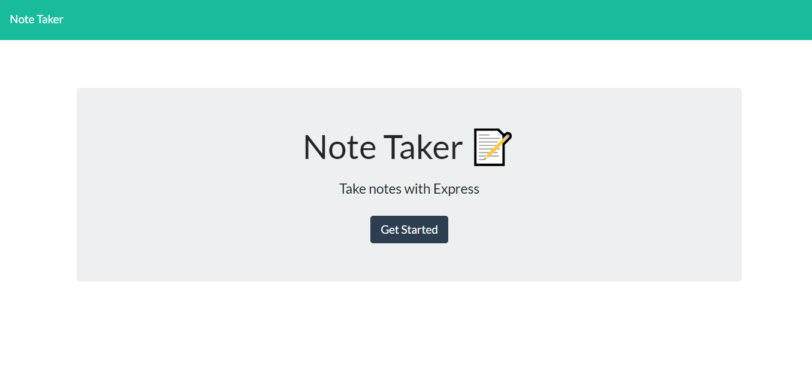

# Note

## General Info

A node express app that users can add, edit, or delete notes.



You can start adding notes [here!](https://obscure-mountain-46426.herokuapp.com/notes)

Or simply clone this repo to your local machine.

Install dependencies
```node.js
npm install
```

Run the application
```node.js
node index.js
```

## User Story
As a user, I want to be able to write and save notes, to be able to delete notes I've written before, so I can organize my thoughts and keep track of tasks I need to complete

## Technologies Used
* HTML
* CSS/Bootstrap
* JavaScript
* NodeJS

## Dependencies
* express 4.16.4
* uuidv1 1.6.14

  
